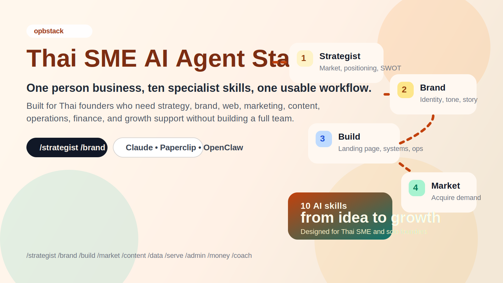

# opbstack 🇹🇭

<p align="center">
  
</p>

<p align="center">
  <a href="LICENSE"></a>
  
  
  
</p>

<p align="center">
  
  &nbsp;&nbsp;&nbsp;
  
  &nbsp;&nbsp;&nbsp;
  
  &nbsp;&nbsp;&nbsp;
  
</p>

<p align="center">
  <strong>Claude Code</strong>
  &nbsp;&nbsp;•&nbsp;&nbsp;
  <strong>Paperclip</strong>
  &nbsp;&nbsp;•&nbsp;&nbsp;
  <strong>OpenClaw</strong>
  &nbsp;&nbsp;•&nbsp;&nbsp;
  <strong>Hermes Agent</strong>
</p>

> **Your one-person business dream team, packaged as 10 AI skills**
>
> *ทีมงานในฝันสำหรับธุรกิจคนเดียวของคุณ — ขับเคลื่อนด้วย AI*

`opbstack` คือ public repo ของชุด prompt + workflow + business context structure สำหรับผู้ประกอบการไทยที่อยากใช้ AI เป็นทีมงานจริง ไม่ใช่แค่ถามตอบเป็นครั้ง ๆ

ภายใน repo นี้เนื้อหาแกนหลักยังใช้ชื่อแนวคิดเดิมว่า `thaismestack` สำหรับ 10 role-based skills

ใช้ได้กับ:
- `Claude Code` สำหรับงานตรง ๆ ใน repo/workspace
- `Paperclip` ถ้าต้องการ multi-agent, issue, approval, budget
- `OpenClaw` ถ้าต้องการ self-hosted multi-provider runtime
- `Hermes Agent` ถ้าต้องการ persistent memory และ self-learning
- `OpenCode` แบบ legacy path สำหรับคนที่ใช้อยู่แล้ว

## Quick Links

- [Install in 30 seconds](#-install--30-seconds-ตัวเลือกหลัก--legacy-path)
- [10 ตำแหน่งงาน](#-ตำแหน่งงาน-10-positions)
- [Context system](#-ระบบ-context-ใหม่--ให้-ai-รู้จักธุรกิจคุณจริง-ๆ)
- [Setup Guide](./SETUP.md)
- [Full Guide](./GUIDE.md)
- [Paperclip Guide](./setup-paperclip.md)
- [OpenCode Legacy Guide](./setup-opencode.md)

## Why This Exists

ธุรกิจ one person business มักมีปัญหาเดิมซ้ำ ๆ:
- งานเยอะเกินกว่าจะทำคนเดียวไหว
- งบไม่พอจะจ้างผู้เชี่ยวชาญครบทุกด้าน
- AI ทั่วไปไม่รู้บริบทธุรกิจจริง เลยตอบกว้างเกินไป
- ไม่มี workflow ว่าควรเริ่มจาก strategy, brand, build, market หรือ data ก่อน

thaismestack แก้ปัญหานี้ด้วย 3 อย่างพร้อมกัน:
- `10 role-based skills` ที่ครอบคลุมตั้งแต่ไอเดียถึง growth
- `context files` ที่ทำให้ AI รู้จักธุรกิจและโปรเจกต์ของคุณ
- `runtime flexibility` เลือกใช้ Claude Code, Paperclip, OpenClaw, Hermes หรือ legacy OpenCode ตามวิธีทำงานของคุณ

## At A Glance

| Layer | What You Get |
|---|---|
| `Skills` | 10 specialist roles เช่น strategist, brand, build, market, data |
| `Context` | `core/`, `business_context/`, `project_context/` เพื่อให้ AI รู้จักธุรกิจจริง |
| `Runtimes` | Claude Code, Paperclip, OpenClaw, Hermes Agent, OpenCode legacy |
| `Use cases` | วางแผนธุรกิจ, ทำแบรนด์, สร้างเว็บ, ทำคอนเทนต์, วิเคราะห์ยอดขาย |

## Workflow Snapshot

```text
Idea -> Strategist -> Brand -> Build -> Market -> Content -> Data -> Serve -> Admin -> Money -> Coach
```

---

## แนวคิด (Philosophy)

### ทำไมต้อง 10 ตำแหน่ง? (Why 10 Positions?)

ธุรกิจ SME ไทยส่วนใหญ่ — โดยเฉพาะ **One Person Business** — มีความท้าทายพิเศษ:

| ความท้าทาย (Challenge) | thaismestack ช่วยอย่างไร (Solution) |
|---|---|
| 🏃‍♂️ ทำคนเดียวหมด ไม่มีเวลา | 10 ตำแหน่งเป็น AI Agent ช่วยทำงานแทน |
| 💸 งบจ้างคนไม่พอ | ไม่ต้องจ้างใคร จ่ายแค่ค่า AI ถูกกว่าจ้างคน 1 คน |
| 🤯 ไม่รู้ว่าต้องเริ่มจากไหน | ลำดับขั้นตอนชัดเจน ตั้งแต่ไอเดียจนถึงขยายธุรกิจ |
| 📚 ไม่มีความรู้เฉพาะทาง | แต่ละตำแหน่งเป็น "ผู้เชี่ยวชาญ" ที่คุณสั่งการได้ |

### แรงบันดาลใจจาก gstack (Inspired by gstack)

[Garry Tan's gstack](https://www.ycombinator.com/blog/why-you-need-a-gstack) มี 23+ ตำแหน่งสำหรับ **Software Engineering** — แต่ธุรกิจ SME ไทยไม่ต้องการอะไรซับซ้อนขนาดนั้น

**thaismestack** จึงเกิดขึ้น:
- ✅ ลดจาก 23+ → **10 ตำแหน่ง** ที่จำเป็นจริง ๆ
- ✅ เปลี่ยนจาก Engineering → **Business Operations**
- ✅ ออกแบบสำหรับ **Thai SME / One Person Business** โดยเฉพาะ

> *"คุณไม่ต้องเป็นวิศวกรซอฟต์แวร์ คุณแค่ต้องเป็นผู้ประกอบการที่มีทีม AI"*
>
> *"You don't need to be a software engineer. You just need to be an entrepreneur with an AI team."*

---

## 10 ตำแหน่งงาน (10 Positions)

> แต่ละตำแหน่งคือ **ไฟล์ Prompt หนึ่งไฟล์** ที่คุณโหลดเข้า AI Agent แล้วใช้งานได้ทันที
>
> *Each position is a **single prompt file** you load into your AI Agent and start using immediately*

| # | ตำแหน่ง (Position) | ทำอะไร (What It Does) | เมื่อไหร่ใช้ (When to Use) |
|---|---|---|---|
| 1 | 💡 **นักวางกลยุทธ์ (Strategist)** | วิเคราะห์ตลาด คู่แข่ง กลุ่มเป้าหมาย วางแผนธุรกิจ | ตั้งแต่ Day 1 — ก่อนเริ่มทำอะไรเลย |
| 2 | 🎨 **นักออกแบบแบรนด์ (Brand Designer)** | สร้างเอกลักษณ์แบรนด์ โลโก้ สี โทนเสียง ค่านิยม | มีไอเดียแล้ว ต้องการภาพลักษณ์ |
| 3 | 🌐 **นักพัฒนาเว็บ (Web Developer)** | สร้างเว็บไซต์ แก้ไข อัปเดต Landing Page | ต้องการหน้าร้านบนโลกออนไลน์ |
| 4 | 📢 **นักการตลาด (Marketer)** | วางแผนการตลาด ช่องทาง งบประมาณ กลยุทธ์ | พร้อมเปิดตัวสินค้า/บริการ |
| 5 | 📝 **นักเขียนคอนเทนต์ (Content Creator)** | เขียนโพสต์ แคปชั่น บทความ สคริปต์วิดีโอ | ต้องการสร้างเนื้อหาโซเชียล |
| 6 | 💰 **นักขาย (Sales)** | สร้างเซลส์ฟันเนล เขียนเสนอราคา ปิดการขาย | มีลูกค้าสนใจ ต้องการแปลงเป็นเงิน |
| 7 | 📊 **นักบัญชี (Accountant)** | จัดการบัญชี ภาษี รายรับรายจ่าย P&L | ทุกเดือน — ธุรกิจต้องมีตัวเลข |
| 8 | ⚖️ **ที่ปรึกษากฎหมาย (Legal Advisor)** | ตรวจสัญญา จดทะเบียน กฎระเบียบที่เกี่ยวข้อง | ก่อนเซ็นสัญญา จดทะเบียนธุรกิจ |
| 9 | 🤝 **นักบริการลูกค้า (Customer Care)** | ตอบคำถาม แก้ปัญหา ดูแลความสัมพันธ์ลูกค้า | มีลูกค้าแล้ว — ดูแลต่อเนื่อง |
| 10 | 📈 **นักวิเคราะห์และเติบโต (Growth Analyst)** | วิเคราะห์ข้อมูล หาจุดเติบโต A/B Testing | เมื่อธุรกิจเริ่มมีข้อมูล — ขยับขยาย |

### 🔄 ลำดับการทำงาน (Workflow Order)

```
┌──────────┐    ┌──────────┐    ┌──────────┐    ┌──────────┐    ┌──────────┐
│  1. 💡   │───►│  2. 🎨   │───►│  3. 🌐   │───►│  4. 📢   │───►│  5. 📝   │
│ Strategist│    │  Brand   │    │   Web    │    │ Marketing│    │ Content  │
└──────────┘    └──────────┘    └──────────┘    └──────────┘    └──────────┘
                                                                                
┌──────────┐    ┌──────────┐    ┌──────────┐    ┌──────────┐    ┌──────────┐
│  6. 💰   │◄───│  7. 📊   │◄───│  8. ⚖️   │◄───│  9. 🤝   │◄───│  10. 📈  │
│  Sales   │    │  Finance │    │  Legal   │    │ Customer │    │  Growth  │
└──────────┘    └──────────┘    └──────────┘    └──────────┘    └──────────┘
```

> **เวอร์ชั่นง่าย:** 💡 → 🎨 → 🌐 → 📢 → 📝 → 💰 → 📊 → ⚖️ → 🤝 → 📈

---

## 🚀 Install — 30 seconds (ตัวเลือกหลัก + legacy path)

**Requirements:** Claude Code / Paperclip / OpenClaw / Hermes Agent / OpenCode (legacy), Git, Bash

> 📌 **อัปเดต 2026-04-23:** OpenCode repository เดิมถูก archive แล้ว และ upstream แนะนำให้ตามโปรเจกต์ **Crush** ต่อ แต่ repo นี้ยังคงเก็บทางเลือก `./setup opencode` ไว้สำหรับคนที่ใช้งาน OpenCode อยู่แล้ว

> 💡 **ModelArk วันนี้เหมาะกับอะไร?** ใช้ Coding Plan เดียวกับเครื่องมือ coding หลักหลายตัวได้ (Claude Code, Codex CLI, Cursor, Roo Code, OpenCode ฯลฯ) และรองรับ model หลักอย่าง Seed-Code, DeepSeek-V3.2, GLM-4.7, Kimi-K2, GPT-OSS โดย availability อาจต่างกันตาม region

### ขั้นตอนที่ 1: One-line Install (OpenCode legacy path)

```bash
# ติดตั้ง OpenCode (ถ้ายังไม่มี)
curl -fsSL https://opencode.ai/install | bash

# ติดตั้ง thaismestack
git clone --single-branch --depth 1 https://github.com/apiasak/opbstack.git ~/thaismestack && cd ~/thaismestack && ./setup opencode
```

### ขั้นตอนที่ 2: ตั้งค่า Model Ark (multi-model)

1. ไปที่ https://console.byteplus.com/ → **ModelArk** → **Coding Plan**
2. Subscribe แผน **Lite $10/เดือน** หรือ **Pro $50/เดือน** ที่หน้า pricing ปัจจุบัน
3. สร้าง API Key → ใส่ใน `~/.config/opencode/thaismestack-example.json`
4. Copy ไฟล์: `cp ~/.config/opencode/thaismestack-example.json ~/.config/opencode/opencode.json`

> หมายเหตุ: BytePlus เคยมี first-order promo ที่ต่ำกว่านี้ แต่ docs ปัจจุบันระบุว่า pricing มาตรฐานเป็น Lite $10 / Pro $50 และ promo เปลี่ยนได้

> 📎 ดูคู่มือเต็ม: [`setup-opencode.md`](setup-opencode.md) | [`setup-paperclip.md`](setup-paperclip.md)

### หรือใช้บนเครื่องมืออื่น

| เครื่องมือ | ราคา/เดือน | Models | คำสั่งติดตั้ง |
|---|---|---|---|
| **OpenCode + Model Ark** `legacy` | **OpenCode ฟรี + ModelArk Lite $10 / Pro $50** | Seed / DeepSeek / GLM / Kimi / GPT-OSS ผ่าน ModelArk | `...&& ./setup opencode` |
| Claude Code | Pro $20, Max $100/$200 หรือ API usage | แค่ Claude | `...&& ./setup` |
| Paperclip 📎 | $20-50+ | ขึ้นกับ adapter และ runtime ที่ผูกไว้ | `...&& ./setup paperclip` |
| OpenClaw 🦞 | ตัวแอป open source แต่ยังมีค่า model/provider ถ้าไม่ใช้ local model | Multi-provider, chat integrations, plugin/skill extensible | `...&& ./setup openclaw` |
| Hermes 🧠 | ตัวแอป open source แต่ยังมีค่า model/provider ถ้าไม่ใช้ local model | Persistent memory, self-learning, multi-provider | `...&& ./setup hermes` |
| ChatGPT 💬 | $20 | แค่ OpenAI | Copy-paste (ไม่ต้องติดตั้ง) |

> 📎 **Paperclip note:** docs รุ่นปัจจุบันของ Paperclip เป็น flow แบบ UI-first หลัง `paperclipai onboard/run` และ built-in adapter keys ใช้ชื่ออย่าง `claude_local`, `openclaw_gateway`, `hermes_local`, `process`

### ขั้นตอนที่ 2: เริ่มใช้งานทันที (Start Using!)

```
/strategist วิเคราะห์ธุรกิจร้านกาแฟของฉัน
/brand      ออกแบบแบรนด์ใหม่
/market     วางแผนการตลาดเดือนหน้า
/content    เขียนแคปชั่น 10 อัน
```

### ขั้นตอนที่ 3: เติมบริบทธุรกิจ (แนะนำ — ทำให้ AI รู้จักคุณ)

```
/ อ่าน business_context/TEMPLATE.md แล้วช่วยฉันกรอกข้อมูลธุรกิจ
```

> หลังจากกรอกเสร็จ บันทึกเป็น `BUSINESS.md` — AI จะจำธุรกิจคุณได้ทุกครั้งที่ใช้งาน

---

## โครงสร้างไฟล์ (File Structure)
```
thaismestack/
├── README.md                      # หน้าหลัก (This file)
├── AGENTS.md                      # รายการ Skill ทั้งหมด
├── GUIDE.md                       # คู่มือใช้งานฉบับเต็ม
├── SETUP.md                       # วิธีติดตั้งทั่วไป
├── setup                          # 🚀 สคริปต์ติดตั้งอัตโนมัติ (Claude/Paperclip/OpenClaw/Hermes/OpenCode legacy)
├── setup-opencode.md              # 📦 คู่มือ OpenCode + Model Ark (legacy path + current notes)
├── setup-paperclip.md             # 📎 คู่มือ Paperclip ฉบับเต็ม
├── LICENSE                        # MIT License
├── .gitignore
│
├── core/                          # 🧠 กติกาการทำงานของ AI
│   ├── CLAUDE.md                  #    กติกา วิธีคิด ข้อจำกัด
│   └── AGENTS.md                  #    คู่มือเรียกใช้ Skill
│
├── business_context/              # 🏪 บริบทธุรกิจ (เติมให้ AI รู้จักคุณ)
│   ├── TEMPLATE.md                #    คำถามที่ต้องตอบ
│   └── EXAMPLE.md                 #    ตัวอย่าง: ร้านกาแฟ "Slow Bar"
│
├── project_context/               # 📁 บริบทโปรเจกต์ (เติมให้ AI รู้งานที่ทำ)
│   ├── TEMPLATE.md                #    คำถามที่ต้องตอบ
│   └── EXAMPLE.md                 #    ตัวอย่าง: เปิดขายออนไลน์
│
├── strategist/SKILL.md            # 1. 💡 นักวางแผนธุรกิจ
├── brand/SKILL.md                 # 2. 🎨 นักออกแบบแบรนด์
├── build/SKILL.md                 # 3. 🔧 สร้างเว็บ/ระบบ
├── market/SKILL.md                # 4. 📢 นักการตลาด
├── content/SKILL.md               # 5. ✍️ นักเขียนคอนเทนต์
├── data/SKILL.md                  # 6. 📊 นักวิเคราะห์ข้อมูล
├── serve/SKILL.md                 # 7. 🫶 ดูแลลูกค้า
├── admin/SKILL.md                 # 8. 📋 ธุรการและเอกสาร
├── money/SKILL.md                 # 9. 💰 การเงินและบัญชี
└── coach/SKILL.md                 # 10. 🌱 พัฒนาตนเองและธุรกิจ
```

---

## 🆕 ระบบ Context ใหม่ — ให้ AI รู้จักธุรกิจคุณจริง ๆ

> **ปัญหาใหญ่ของ AI**: AI ไม่รู้จักธุรกิจคุณ — ต้องถามซ้ำ ๆ ทุกครั้ง  
> **วิธีแก้**: เติม **3 โฟลเดอร์ Context** ก่อนเริ่มใช้งาน แล้ว AI จะจำและตอบได้ตรงใจ

```
┌─────────────────────────────────────────────────────────────────────┐
│                                                                     │
│   core/              → กติกาการทำงานของ AI (กฎ ข้อจำกัด)          │
│   business_context/  → AI รู้จักธุรกิจคุณ (ขายอะไร ใครซื้อ)         │
│   project_context/   → AI รู้ว่ากำลังทำอะไร (เป้าหมาย สถานะ)        │
│                                                                     │
│   + 10 Skills        → AI ทำงานได้ถูกต้อง ตรงใจ ไม่ต้องถามซ้ำ      │
│                                                                     │
└─────────────────────────────────────────────────────────────────────┘
```

### 📂 core/ — กติกาการทำงานของ AI

ไฟล์ | ทำอะไร
---|---
`CLAUDE.md` | กติกา วิธีคิด รูปแบบการตอบ ข้อจำกัด
`AGENTS.md` | วิธีเรียกใช้ skill การสลับ skill การ chain skill

**ตัวอย่าง**: ถ้าอยากให้ AI ตอบสั้น ๆ กระชับ → แก้ใน `CLAUDE.md`  
**ตัวอย่าง**: ถ้าอยากให้ AI ถามกลับเสมอ → เพิ่มกฎใน `CLAUDE.md`

### 📂 business_context/ — บริบทธุรกิจ (ให้ AI รู้จักคุณ)

**ขั้นตอน**:
1. กรอกคำถามใน `TEMPLATE.md` → ธุรกิจอะไร ลูกค้าใคร แบรนด์เป็นยังไง
2. บันทึกเป็น `BUSINESS.md`
3. บอก AI: *"อ่าน business_context ก่อนตอบ"*

**ผลลัพธ์**: AI จะรู้ว่าคุณขายอะไร ลูกค้าเป็นใคร ไม่ต้องเล่าใหม่ทุกครั้ง

> 📖 ดูตัวอย่างที่กรอกแล้วใน `business_context/EXAMPLE.md` (ร้านกาแฟ "Slow Bar")

### 📂 project_context/ — บริบทโปรเจกต์ (ให้ AI รู้งานที่ทำ)

**ขั้นตอน**:
1. กรอกคำถามใน `TEMPLATE.md` → เป้าหมายอะไร อยู่ตรงไหน ทำ/ไม่ทำอะไร
2. บันทึกเป็น `PROJECT.md`
3. บอก AI: *"อ่าน project_context ก่อนช่วยทำงานนี้"*

**ผลลัพธ์**: AI จะรู้ว่างานนี้เป้าหมายอะไร มีข้อจำกัดยังไง ไม่เสนออะไรที่ห้ามทำ

> 📖 ดูตัวอย่างที่กรอกแล้วใน `project_context/EXAMPLE.md` (เปิดขายออนไลน์)

### 💡 วิธีใช้งานร่วมกัน

```
คุณ: "อ่าน business_context และ project_context ก่อนตอบ
      แล้วช่วย /market วางแผนการตลาดเดือนหน้า"

AI:  [อ่าน BUSINESS.md → รู้ว่าคุณขายกาแฟ specialty 
      อ่าน PROJECT.md → รู้ว่ากำลังจะเปิดขายออนไลน์
      อ่าน market/SKILL.md → ทำตาม workflow นักการตลาด]

AI:  "ได้เลย! จากที่อ่านบริบท ร้าน Slow Bar กำลังจะเปิดขายออนไลน์ 
      ลูกค้าเป้าหมายเป็น working professional อายุ 25-40...
      แผนการตลาดเดือนหน้าแนะนำให้เน้น Instagram และ LINE OA ก่อน..."
```

---

## ตัวอย่างการใช้งาน (Example Session)

### สถานการณ์: "เปิดร้านกาแฟ Specialty" ☕

> คุณอยากเปิดร้านกาแฟ ทำคนเดียว มีงบจำกัด ใช้ **thaismestack** ตั้งแต่ต้นจนจบ:

---

**🗣️ คุณ:** `/strategist ฉันอยากเปิดร้านกาแฟ specialty ย่านสุขุมวิท`

**🤖 AI (Strategist):**
> ✅ วิเคราะห์ตลาดกาแฟย่านสุขุมวิท
> ✅ คู่แข่งหลัก 5 ราย + จุดแข็ง/จุดอ่อน
> ✅ กลุ่มเป้าหมาย: อายุ 25-40, รายได้ 35K+, ชอบ specialty coffee
> ✅ แผนธุรกิจ 3 เดือนแรก

---

**🗣️ คุณ:** `/brand ช่วยสร้างแบรนด์ร้านกาแฟชื่อ "Slow Bar"`

**🤖 AI (Brand):**
> ✅ คอนเซ็ปต์: "Slow down, sip better"
> ✅ โทนสี: Earth tone + Deep Green
> ✅ ฟอนต์: Minimal, เรียบง่าย
> ✅ โทนเสียง: Friendly, Knowledgeable, Unhurried
> ✅ Tagline: "ทุกแก้ว คือ จังหวะที่ดีของวัน"

---

**🗣️ คุณ:** `/build สร้างเว็บสำหรับร้าน Slow Bar`

**🤖 AI (Build):**
> ✅ Landing Page พร้อมรูปภาพสไตล์
> ✅ เมนูกาแฟ + ราคา
> ✅ ระบบจองโต๊ะ
> ✅ แผนที่ + วิธีมาร้าน
> ✅ โค้ด HTML/CSS/JS พร้อม deploy

---

**🗣️ คุณ:** `/content สร้างคอนเทนต์เปิดร้าน 10 โพสต์แรก`

**🤖 AI (Content):**
> ✅ โพสต์ที่ 1: "ทำไมถึงชื่อ Slow Bar"
> ✅ โพสต์ที่ 2: "Behind the beans — เส้นทางกาแฟจากฟาร์มสู่แก้ว"
> ✅ โพสต์ที่ 3-10: ทิปส์กาแฟ, สตอรี่บาริสต้า, โปรโมชั่นเปิดร้าน...
> ✅ แคปชั่นภาษาไทย พร้อมแฮชแท็ก #slowbarbkk

---

**🗣️ คุณ:** `/market วางแผนการตลาดเดือนแรก`

**🤖 AI (Market):**
> ✅ แผน Soft Launch — ชวนลูกค้าประจำมาก่อน
> ✅ โฆษณา Instagram งบ 5,000 บาท/เดือน
> ✅ คอลแลบกับ Blogger/Foodie 3 คน
> ✅ โปรโมชั่น "ซื้อ 10 แก้ว แถม 1"

---

**🗣️ คุณ:** `/serve ออกแบบระบบสะสมแต้มให้ลูกค้ากลับมาซ้ำ`

**🤖 AI (Serve):**
> ✅ ระบบ "Slow Point" — ซื้อ 1 แก้ว = 1 ดาว สะสม 10 ดาว แถมฟรี 1 แก้ว
> ✅ เกิดขึ้น Birthday Reward — แก้วฟรีวันเกิด
> ✅ LINE OA แจ้งเตือนเมื่อใกล้แลกของขวัญ
> ✅ สคริปต์ทักทายลูกค้ากลับมาหลังไม่มานาน

---

**⏰ ผ่านไป 3 เดือน...**

**🗣️ คุณ:** `/data วิเคราะห์ยอดขาย Q1 แล้วแนะนำจุดเติบโต`

**🤖 AI (Data):**
> ✅ ลูกค้าประจำเพิ่ม 40% จากระบบสะสมแต้ม
> ✅ ช่วงเช้า (7-9 โมง) ขายดีที่สุด
> ✅ โอกาสเติบโต: Delivery, Workshop ชงกาแฟ, ขายเมล็ดกาแฟออนไลน์
> ✅ A/B Test: โปรโมชั่นใหม่สำหรับช่วงบ่าย

---

**🗣️ คุณ:** `/money คำนวณต้นทุนและกำไรเดือนที่ผ่านมา`

**🤖 AI (Money):**
> ✅ ต้นทุนวัตถุดิบเฉลี่ย 35% ของรายได้
> ✅ ค่าเช่าร้าน 25% ค่าใช้จ่ายอื่น 15%
> ✅ กำไรสุทธิ ~25% (ดีกว่าค่าเฉลี่ยร้านกาแฟที่ 10-15%)
> ✅ แนะนำ: ขายเมล็ดกาแฟออนไลน์มี margin สูงกว่า 60%

---

### 🎉 สรุป: จาก 0 → ธุรกิจจริง ด้วยทีม AI 10 ตำแหน่ง!

> *From zero to a real business — with a 10-position AI team!*

---

## เปรียบเทียบกับ gstack (Comparison with gstack)

| gstack (23+ ตำแหน่ง) | → | thaismestack (10 ตำแหน่ง) |
|---|---|---|
| **สำหรับ:** Software Engineering | | **สำหรับ:** Thai SME Business Operations |
| **ผู้ใช้:** บริษัทเทคโนโลยี / Startup | | **ผู้ใช้:** เจ้าของธุรกิจคนเดียว / SME |
| **ความซับซ้อน:** สูง | | **ความซับซ้อน:** ต่ำ — เข้าใจง่าย |
| **ภาษา:** อังกฤษ 100% | | **ภาษา:** ไทยเป็นหลัก + อังกฤษ |

### แมพปิ้งตำแหน่ง (Position Mapping)

```
gstack: 23+ ตำแหน่งสำหรับ Engineering ────────────
  ├── Product Manager
  ├── Engineering Manager
  ├── Tech Lead
  ├── Backend Developer
  ├── Frontend Developer
  ├── DevOps Engineer
  ├── QA Engineer
  ├── Security Engineer
  ├── Data Engineer
  ├── Data Scientist
  ├── ML Engineer
  ├── UX Designer
  ├── UI Designer
  ├── UX Researcher
  ├── Technical Writer
  ├── SRE
  ├── Platform Engineer
  ├── ... (อีกหลายตำแหน่ง)

thaismestack: 10 ตำแหน่งสำหรับ Business ───────────
  ├── 1. 💡 /strategist  ← วางแผนกลยุทธ์
  ├── 2. 🎨 /brand       ← สร้างแบรนด์
  ├── 3. 🔧 /build       ← สร้างเว็บ/ระบบ
  ├── 4. 📢 /market      ← การตลาด
  ├── 5. ✍️ /content     ← คอนเทนต์
  ├── 6. 📊 /data        ← วิเคราะห์ข้อมูล
  ├── 7. 🫶 /serve       ← ดูแลลูกค้า
  ├── 8. 📋 /admin       ← ธุรการ
  ├── 9. 💰 /money       ← การเงิน
  └── 10. 🌱 /coach      ← พัฒนาตนเอง
```

> **gstack = สร้างซอฟต์แวร์ที่ scale ได้**
> **thaismestack = สร้างธุรกิจที่ยั่งยืน**
>
> *gstack = Build software that scales*
> *thaismestack = Build a business that lasts*

---

## สร้างโดย (Created By)

### 👤 Apipoj Piasak (อภิพจน์ เพียศักดิ์)

| | |
|---|---|
| 🌐 **Website** | [data-espresso.com/apipoj](https://data-espresso.com/apipoj) |
| 💼 **Expertise** | Data & AI \| Digital Transformation \| MarTech \| UX \| Digital Marketing |
| ⏳ **Experience** | 20+ Years in Tech & Business |
| 🇹🇭 **Based in** | Bangkok, Thailand |

### ทำไมถึงสร้าง thaismestack?

> *"ผมเห็นธุรกิจ SME ไทยจำนวนมาก — โดยเฉพาะ One Person Business — ต้องดิ้นรนทำทุกอย่างคนเดียว ในขณะที่ AI Agent สามารถช่วยทำงานส่วนใหญ่ได้แล้วในปี 2025"*
>
> *"ผมอยากเห็นผู้ประกอบการไทยมีเครื่องมือที่เข้าใจง่าย ใช้ได้จริง และออกแบบมาสำหรับบริบทธุรกิจไทยโดยเฉพาะ"*
>
> *"I see so many Thai SMEs — especially One Person Businesses — struggling to do everything alone, while AI Agents can handle most of these tasks in 2025."*
>
> *"I want Thai entrepreneurs to have a tool that's easy to understand, practical, and designed specifically for the Thai business context."*

---

## สิ่งที่คุณจะได้รับ (What You Get)

| | |
|---|---|
| ✅ 10 ไฟล์ Prompt ที่ใช้ได้ทันที | *10 ready-to-use prompt files* |
| ✅ คำแนะนำภาษาไทยทุกขั้นตอน | *Thai language instructions at every step* |
| ✅ ตัวอย่างการใช้งานจริง | *Real-world usage examples* |
| ✅ ฟรีและ Open Source | *Free and Open Source* |
| ✅ อัปเดตอย่างต่อเนื่อง | *Continuously updated* |

---

## ข้อควรทราบ (Notes)

- 🤖 AI Agent เป็น **ผู้ช่วย** ไม่ใช่ผู้ทดแทนมนุษย์ 100% — คุณยังต้องตัดสินใจและดำเนินการเอง
- 🔍 ตรวจสอบข้อมูลสำคัญ (เช่น กฎหมาย ภาษี) กับผู้เชี่ยวชาญจริงก่อนดำเนินการ
- 🔄 แต่ละธุรกิจมีบริบทต่างกัน — ปรับแต่ง Prompt ให้เหมาะกับคุณ

- *🤖 AI Agents are **assistants**, not 100% human replacements — you still need to decide and act.*
- *🔍 Verify critical information (legal, tax) with real experts before acting.*
- *🔄 Every business is different — customize prompts for your needs.*

---

## License

[MIT](LICENSE) © 2025 Apipoj Piasak | data-espresso.com

---

<div align="center">

### 🇹🇭 สนับสนุนธุรกิจไทย ด้วยพลัง AI 🇹🇭
### *Empowering Thai Businesses with AI*

**⭐ Star โปรเจคนี้ถ้าคิดว่ามีประโยชน์ | Star this project if you find it useful! ⭐**

[Website](https://data-espresso.com/apipoj) • [Issues](../../issues) • [Contribute](../../blob/main/CONTRIBUTING.md)

</div>
